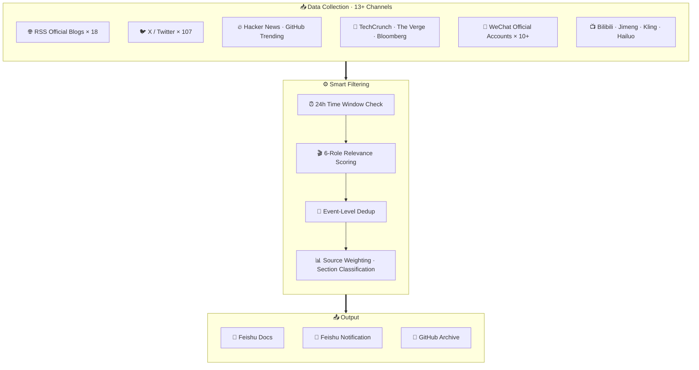

  <h1 align="center">AI Film & Creation Daily</h1>
  

    <strong>Daily AI intelligence briefing for filmmakers and content creators</strong>
  

  

    <a href="daily/2026-04-13.md">📋 Latest Issue</a> · 
    <a href="#archive">📁 Archive</a> · 
    <a href="docs/">📚 Docs</a> · 
    <a href="#contributing">🤝 Contribute</a> · 
    <a href="https://github.com/chenmozhe008/ai-film-daily/issues">💬 Issues</a>
  

  

    <b>🌐 Language:</b> <a href="README.md">中文</a> | English
  

---

## About

**AI Film & Creation Daily** is a daily AI intelligence briefing for filmmakers and content creators. Not a generic AI news aggregator — **only information with real creative value makes the cut.**

### Sections

| # | Section | Content |
|---|---------|---------|
| 1 | **Industry & Platform Trends** | Model releases, platform updates, funding, policy, ecosystem shifts |
| 2 | **Tools & Capabilities** | Meaningful capability updates for the creative pipeline |
| 3 | **Methods & Workflows** | Actionable, transferable creative methods and workflows |
| 4 | **Works & Case Studies** | AI films, animations, and visual experiments worth studying |

### Time Window

- **Strict 24-hour window**: previous day 08:00 ~ current day 08:00 (Asia/Shanghai)
- Content older than 36 hours is excluded, no matter how important

---

## Architecture

---

## Data Sources

### Primary Sources (International)

| Source Type | Tool | Coverage |
|-------------|------|----------|
| RSS Official | feedparser | OpenAI / Anthropic / Runway / Midjourney etc. 18+ feeds |
| X / Twitter | twitter-cli | 7 categories, 107+ accounts full scan |
| Hacker News | REST API | Top 200 stories, filtered for AI-related high-score content |
| GitHub Trending | REST API | AI / video generation / image generation projects |
| Tech Media | web_fetch | TechCrunch / The Verge / Reuters / Bloomberg etc. |

### Secondary Sources (Chinese)

| Source Type | Tool | Coverage |
|-------------|------|----------|
| Chinese AI Tool Sites | Playwright | Jimeng / Kling / Hailuo SPA site rendering |
| WeChat Official Accounts | Exa + API | 10+ core accounts (workflow breakdowns, case studies) |
| Bilibili | bili-cli | AI short films / animations / tutorials, filtered by views |
| Chinese Tool Monitoring | web_search | Jimeng / Seedance / Kling / Vidu update tracking |

---

## Content Filtering

### Creator Relevance Scoring

Each candidate is scored (1-10) across **6 creator roles** and must pass the threshold:

| Role | Focus |
|------|-------|
| R1 AI Director | Narrative, storyboard, lens language, visual storytelling |
| R2 AI Producer | Cost, efficiency, business opportunities, platform policy |
| R3 Visual Artist | Style generation, character consistency, visual development |
| R4 Post-Production | Dubbing, subtitles, color grading, video post-processing |
| R5 Short-Form Creator | Mass production, IP derivatives, platform distribution |
| R6 Tech Integrator | Toolchain, API integration, workflow automation |

**Passing Threshold:**
- Industry Trends / Tool Updates: at least 2 roles ≥ 6
- Methods / Case Studies: at least 2 roles ≥ 8

---

## Tech Stack

| Component | Technology | Description |
|-----------|------------|-------------|
| AI Engine | [OpenClaw](https://docs.openclaw.ai) | Automation agent platform driving the full pipeline |
| LLM | GLM-5 / Gemini | Content filtering, scoring, summary generation |
| X Collection | twitter-cli | Cookie auth + GraphQL API |
| Bilibili | bili-cli | Structured search + view count sorting |
| Web Rendering | Playwright | SPA site scraping (Chinese AI tool sites) |
| RSS | feedparser | 18+ official blog feeds |
| Output | Feishu + GitHub | Feishu doc archive + GitHub public release |

---

## Archive

| Date | Link |
|------|------|
| 2026-04-13 | [📄 View](daily/2026-04-13.md) |
| 2026-04-07 | [📄 View](daily/2026-04-07.md) |
| 2026-04-03 | [📄 View](daily/2026-04-03.md) |

---

## Contributing

We welcome all contributions to improve this daily briefing!

- 💡 **Suggest Sources** — Found a great AI creative info source? Open an [Issue](https://github.com/chenmozhe008/ai-film-daily/issues)
- ✏️ **Fix Errors** — Spot a mistake in the daily report? Let us know
- 🎬 **Recommend Works** — Discovered an AI film worth analyzing? Submit it

### How to Contribute

1. Fork this repository
2. Create a feature branch (`git checkout -b feature/xxx`)
3. Commit your changes and open a Pull Request

See [CONTRIBUTING.md](CONTRIBUTING.md) for details.

---

## License

[MIT License](LICENSE) © 2026

---

  Built with ❤️ by AI Film & Creation Daily Bot · Powered by <a href="https://docs.openclaw.ai">OpenClaw</a>

