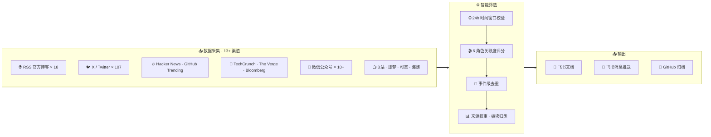

  <h1 align="center">AI Film & Creation Daily</h1>
  

    <strong>面向影视创作者的 AI 信息日报</strong>
  

  

    <a href="daily/2026-04-13.md">📋 最新日报</a> · 
    <a href="#日报列表">📁 历史归档</a> · 
    <a href="docs/">📚 文档</a> · 
    <a href="#贡献指南">🤝 参与贡献</a> · 
    <a href="https://github.com/chenmozhe008/ai-film-daily/issues">💬 反馈</a>
  

  

    <b>🌐 语言：</b> 中文 | <a href="README.en.md">English</a>
  

---

## 关于

**AI Film & Creation Daily** 是一份面向影视创作者的每日 AI 信息简报。不是泛 AI 新闻聚合，也不是技术圈的工具快讯——**只收录对影视创作者有实际参考价值的信息**。

### 栏目结构

| # | 栏目 | 内容 |
|---|------|------|
| 1 | **行业与平台动向** | 模型发布、平台能力、融资、政策、生态变化 |
| 2 | **工具与能力更新** | 对创作链路真正有帮助的能力更新 |
| 3 | **方法与经验** | 可执行、可迁移、可复用的创作方法 |
| 4 | **作品 / 案例** | 值得拆解的 AI 影视作品和传播样本 |

### 时间窗口

- **严格 24 小时**：前一天 08:00 ~ 当天 08:00（Asia/Shanghai）
- 超过 36h 的内容，无论多重要都不纳入

---

## 系统架构

---

## 采集源

### 主链路（国际优先）

| 来源类型 | 工具 | 覆盖范围 |
|----------|------|----------|
| RSS 官方源 | feedparser | OpenAI / Anthropic / Runway / Midjourney 等 18+ 源 |
| X / Twitter | twitter-cli | 7 个分类、107+ 账号全量扫描 |
| Hacker News | REST API | Top 200 stories，筛选 AI 相关高赞内容 |
| GitHub Trending | REST API | AI / 视频生成 / 图像生成相关新项目 |
| 英文科技媒体 | web_fetch | TechCrunch / The Verge / Reuters / Bloomberg 等 |

### 补充链路（中文辅助）

| 来源类型 | 工具 | 覆盖范围 |
|----------|------|----------|
| 国产工具官网 | Playwright | 即梦 / 可灵 / 海螺 SPA 网站渲染采集 |
| 微信公众号 | Exa + API | 10+ 核心账号（方法总结 / 创作复盘 / 案例拆解） |
| B站 | bili-cli | AI 短片 / 动画 / 教程，按播放量筛选 |
| 国产工具扫描 | web_search | 即梦 / Seedance / Kling / Vidu 更新监控 |

---

## 内容筛选

### 创作者关联度评分

每条候选内容从 **6 类创作者角色** 分别打分（1-10），必须满足通过线才能入选：

| 角色 | 关注重点 |
|------|----------|
| R1 AI 编导 / 导演 | 叙事、分镜、镜头语言、视觉叙事 |
| R2 AI 制片人 | 成本、效率、商业机会、平台政策 |
| R3 视觉 / 美术 | 风格生成、角色一致性、视觉开发 |
| R4 后期 / 声音 | 配音、字幕、调色、视频后处理 |
| R5 短剧 / 短内容 | 批量生产、IP 衍生、平台分发 |
| R6 技术整合者 | 工具链打通、API 集成、工作流自动化 |

**通过线：**
- 行业动向 / 工具更新：至少 2 类角色 ≥ 6
- 方法与经验 / 作品案例：至少 2 类角色 ≥ 8

---

## 技术栈

| 组件 | 技术 | 说明 |
|------|------|------|
| AI 引擎 | [OpenClaw](https://docs.openclaw.ai) | 自动化 Agent 平台，驱动采集→处理→输出 |
| 大模型 | GLM-5 / Gemini | 内容筛选、评分、摘要生成 |
| X 采集 | twitter-cli | Cookie 认证 + GraphQL API |
| B站采集 | bili-cli | 结构化搜索 + 播放量排序 |
| 网页渲染 | Playwright | SPA 网站采集（国产工具官网） |
| RSS | feedparser | 18+ 官方博客源 |
| 输出 | 飞书 + GitHub | 飞书文档存档 + GitHub 公开发布 |

---

## 日报列表

| 日期 | 链接 |
|------|------|
| 2026-04-13 | [📄 查看](daily/2026-04-13.md) |
| 2026-04-07 | [📄 查看](daily/2026-04-07.md) |
| 2026-04-03 | [📄 查看](daily/2026-04-03.md) |

---

## 贡献指南

欢迎所有人参与完善这份日报！

- 💡 **推荐信息源** — 提 [Issue](https://github.com/chenmozhe008/ai-film-daily/issues) 告诉我们
- ✏️ **内容纠错** — 日报内容有误？随时指出
- 🎬 **作品推荐** — 发现值得拆解的 AI 影视作品？提交给我们

### 如何贡献

1. Fork 本仓库
2. 创建特性分支 (`git checkout -b feature/xxx`)
3. 提交修改并发起 Pull Request

详见 [CONTRIBUTING.md](CONTRIBUTING.md)

---

## 许可证

[MIT License](LICENSE) © 2026

---

  由 AI Film & Creation Daily Bot 构建 · 基于 <a href="https://docs.openclaw.ai">OpenClaw</a> 驱动

